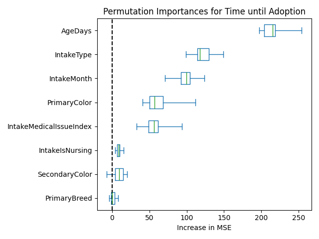

# San Jose Animal Shelter Analysis

> By Dylan Starink

## Overview

This project analyzes animal intake and outcome data from the San Jose Animal Shelter, focusing specifically on cats. The goal of this project is to determine what factors are important in (1) whether or not a specific cat gets adopted and (2) if they will be adopted, how long will it take?

Ultimately we found that for determining whether the cat will be adopted or not, that the most important
factors were: their Age, Intake Type (how they got to the shelter e.g., Stray, Foster, a Return, etc.), what month they were intaken, and lastly, the degree of medical issues they had. While for how long until a cat was adopted, we see the most prominant factors were the same factors as classification (age, intake type, intake month, and medical issue index) as well a very slight effect from primary color of the cat.

## Data

Dataset Website: https://data.sanjoseca.gov/dataset/animal-shelter-intake-and-outcomes

This dataset is quite comprehensive. It has records of tens of thousands of
animals that have passed through the animal shelter. The dataset includes records about
lost/found reports, stray and owned animals spay/neuter clinics, returned or confiscated animals,
as well as the usual stray animals that are turned in.

Key features:

- **Animal Characteristics**: Animal Type, Color, Breed, Sex, Age
- **Shelter Events**: Intake + Outcome Date, Condition, and Type

## Details

For classification, we used a random forest to predict whether a given cat would be adopted or not. We used these features in building the baseline model: "IntakeMonth"
"IntakeMedicalIssueIndex"
"IntakeType"
"PrimaryBreed"
"PrimaryColor"
"SecondaryColor"
"IntakeIsNursing"

On binary classification. We achieved a precision of 0.73, recall of 0.70 and an f1 score of 0.72.

See the confusion matrix, PR and ROC curves below:

Below is the plot of permutation importance for each of
the features:

We see that Age days has a very large importance (which makes sense, as older cats will be eligible for adoption while very young cats (a large proportion of intaked cats are often placed into foster care)). As well as intake type, intake month and medical issue index.

Below, we have a graph of age vs. adoption proportion. As we can see, more cats get adopted as we near the maturity age (where they can be spayed/neutered) of 4-7 weeks.

While we see another effect for older cats, as they get older, the less likely they are to be adopted.

For adoption rates per intake type, we see the cats that have the lowest adoption rate are strays (which make sense, due to the number of injuries and other issues they may have). While the highest is suprisingly euthanasia request and (as expected) returns and fosters.

Then, for intake month we see that right before kitten season (not around any holidays or peak kitten season when there are plenty of cats to choose from), adoption rates drop before picking up for kitten season (peak kitten intake during May).

Lastly, for medical issues, we see that serious medical issues (level 3 and 4) have very, very low adoption rates, while routine medical issues (1+2) are adopted at the same rates as normal cats.

Previously, we saw a large impact of SpayedNeutered, which was due to target leakage, as cats who are being adopted will be spayed/neutered beforehand, while other cats won't be. There was a similar issue with Sex, as sex is very hard to determine of a young cat, thus the sex was being updated after spay/neuter procedures, leading to 0 adopted kittens having unknown sex, while non-adopted kitties have quite a lot being labeled with unknown sex (as you can see in the graph below). Because of this target leakage potential and the difficulty with determining sex, we removed it from our analysis.

For regression, we ended up finding that the Histogram-based Gradient Boosting Classification Regressor performed the best with an MSE of 346 and explained variance of 0.35. We used the same features as on classification.

For the features, we see the same ones here on on the permutation importances from classification, but with more emphasis on some other features such as primary color.

We can clearly see how age would play into it, as cats will need to wait until they are spayed/neutered to be adopted, so we see how younger cats have longer times to wait then older cats.

It's very hard to see how color impacts the time to adopt, even though the model says there are some correlations, its hard to see via inspection of the histograms for the 2 most common cats (black and tabby) and the lowest median adopt time (point).

## Case Studies

We can use the SHAP waterfall plots to see what factors are important for making a certain decision.

Below, we can see the model accurately determining this cat will not be adopted, due primariliy to its severe injuries (medical issue index of 3) and being relatively young (harder for a cat to recover).

Here, we see a much more challenging case, where there is likely much irreducible error, since this is a super common case of cat (very likely color, age, month, etc.). This is probably down to the temperment of the cat, which we don't have access to in this dataset. So the model makes a poor decision and says this cat is not likely to be adopted, even though it did end up being adopted. This shows the weak points of how cats without any clear features are hard to predict for, as opposed to the severe medical case.

